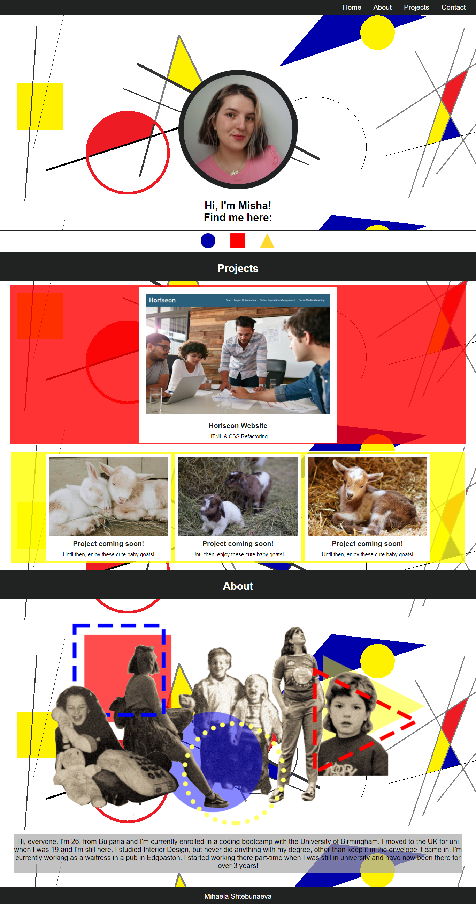
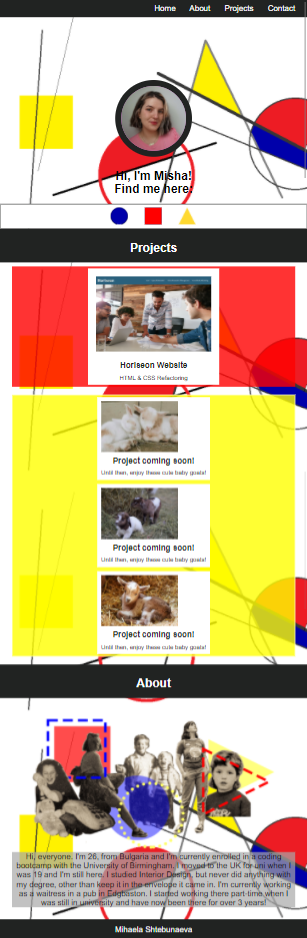
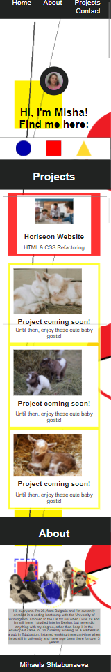
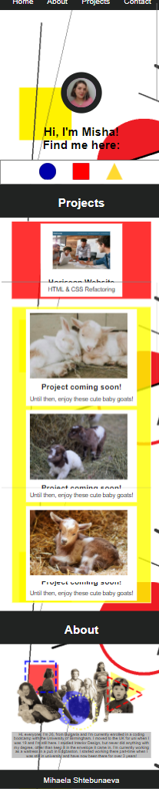

# My Personal Portfolio

## Table of content :

- [_Project Link_](#project-link)
- [_About my Project_](#about-my-project)
- [_Screenshots_](#screenshots)

## Project Link

[_View my portfolio here!_](https://misha244.github.io/my_personal_portfolio/)

## About my Project

This is my personal portfolio. I've created it as a homework during week 2 of my Coding Bootcamp, but will be updating it as I complete more projects and further develop my skills. Ultimately this portfolio will hopefully serve as a stepping stone in my future career in tech. I've utilised the **_HTML/CSS_** skills I've gained so far and gained a few more, while working on it. I have incorporated **media queries**, **flex container** and **CSS variables** to create a responsive and functional portfolio.

[_More information on the design of my page_](assets/images/inspo-images/../inspo_images/Portfolio-moodboard.pdf)

## Screenshots

#### Desktop/Laptop view

#### Tablet view

#### Phone view _(iPhone 5, 5S, 5C and 5SE)_

#### Phone view _(iPhone 6+, 7+ and 8+)_

